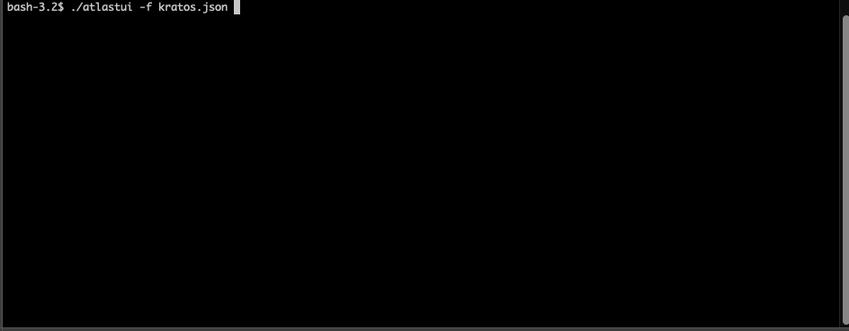

# AtlasTUI

Pronounced "atla-stewie", `atlastui` is an [atlas](https://atlasgo.io/) text user interface.



## Installation

```sh
go install github.com/akosmarton/atlastui@latest
```

## TODO

### Technicalities

- Handle non-tty terminals
- Verify terminal resize
- Verify Windows compatibility
- Verify light terminal
- Get rid of width alignment magic numbers (also in bubbles fork)

### Features

- Set consistent color style
- Add search in ui components
- Link between tables/indexes etc
- Support non-json formats (hcl, mermaid)
- Support views, funcs, procedures.
- Support multiple schemas
